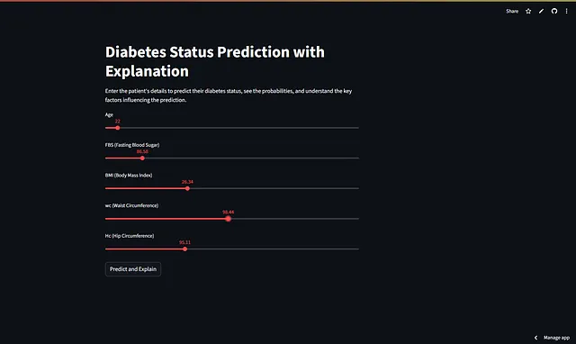
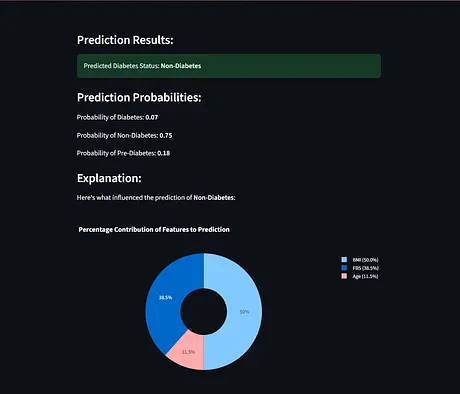
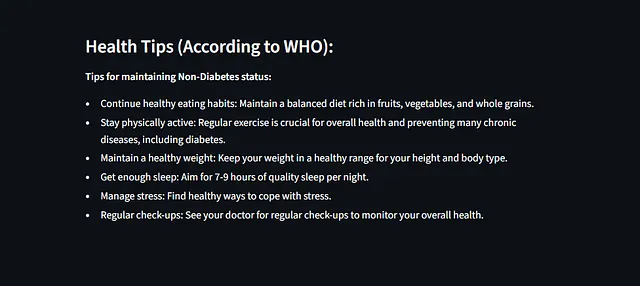

# 🩺 Diabetes / Pre-Diabetes Detection & Explanation App

  

  <strong>Explainable AI–powered diabetes risk classification for patients and clinicians</strong> 
  Built using Machine Learning (Random Forest + SHAP) and deployed with Streamlit

  <a href="https://diabetes-prediabetesdetectionapp-r7qgyyppn8zezyrt5hvivv.streamlit.app/" target="_blank"><b>▶ Live Demo</b></a> |
  <a href="https://github.com/AdityaRKori/Diabetes-PreDiabetes_DetectionApp" target="_blank"><b>GitHub Repo</b></a>

---

## Summary

**Diabetes-PreDiabetes_DetectionApp** is an interactive ML-powered health screening tool that classifies users into:

- **Diabetic**
- **Pre-Diabetic**
- **Non-Diabetic**

using routinely available clinical parameters such as **Fasting Blood Sugar (FBS), BMI, age, waist circumference, and hip circumference**.  
The application combines **robust classification (Random Forest)** with **Explainable AI (SHAP)** so predictions are transparent and interpretable for both doctors and patients.

---

## Problem Statement

Diabetes is one of the fastest-growing chronic diseases in India and globally. While early detection can prevent severe complications, many predictive models remain inaccessible to real users.

Key challenges:
- Risk detection often happens late
- Patients do not understand *why* they are at risk
- Clinical ML models are rarely explainable
- Research models are not translated into usable tools

This project addresses these gaps by delivering an **accessible, explainable, browser-based screening app**.

---

## Dataset & Ethical Acknowledgement

- **Dataset Provider:** SugaVazhu – Primary Care Provider, Thanjavur, Tamil Nadu  
- **Usage:** Formal institutional permission obtained for academic research and application development  
- **Privacy:** All patient records were anonymized prior to analysis  

This acknowledgement is stated explicitly to ensure transparency and ethical responsibility.

---

## Model Building Approach

Multiple ML strategies were explored to balance **accuracy**, **robustness**, and **interpretability**:

- **Regression models** for baseline trend understanding  
- **Classification algorithms** for categorical risk stratification  
- **Random Forest Classifier** for:
  - Handling non-linear feature interactions
  - Reducing overfitting
  - Stable performance on real-world clinical data

### Explainable AI (XAI)

To avoid black-box predictions, **SHAP (SHapley Additive exPlanations)** was integrated:

- Quantifies how much each feature contributes to the prediction
- Visualizes feature importance as percentage contribution
- Helps clinicians and patients understand *why* a prediction was made

---

## Application Walkthrough

The Streamlit app is designed for simplicity and clarity.

---

### 1️⃣ Patient Input Interface
**File:** 

Users enter:
- Age
- Fasting Blood Sugar (FBS)
- BMI
- Waist Circumference
- Hip Circumference

A single click triggers prediction and explanation.

---

### 2️⃣ Prediction Results & Probabilities
**File:**  

Displays:
- Predicted diabetes status (Diabetic / Pre-Diabetic / Non-Diabetic)
- Probability score for each class
- Clear result banner for quick interpretation

---

### 3️⃣ SHAP Feature Contribution Visualization
**File:**  

A donut/pie chart shows:
- Percentage contribution of each feature (FBS, BMI, Age, Waist/Hip)
- Visual explanation of model reasoning
- Enables informed discussion between patient and doctor

---

### 4️⃣ WHO-Aligned Health Guidance

Based on the predicted category, the app displays **WHO-aligned lifestyle and care recommendations**, helping users take actionable next steps.

---

## Example User Flow

1. User enters basic health metrics  
2. Model predicts diabetes category  
3. SHAP explains which factors influenced the result  
4. App provides WHO-based health tips  
5. User discusses results with clinician or plans preventive action  

---

## Impact & Use Cases

- **Patients:** Early awareness and preventive decision-making  
- **Doctors:** Supportive screening tool with transparent reasoning  
- **Public Health:** Scalable, low-cost risk screening  
- **Researchers:** Extendable framework for explainable clinical ML  

---

## Limitations

- Model trained on a regional dataset; retraining required for other populations  
- Outputs are probabilistic, not diagnostic  
- Should be used only as a **decision-support** tool, not a medical verdict  

---

## Future Improvements

- Expand dataset with multi-regional clinical data  
- Integrate mobile health and wearable data  
- Add personalized lifestyle and diet recommendations  
- Longitudinal tracking of patient risk over time  

---

## Project Structure

Diabetes-PreDiabetes_DetectionApp/
- ├── app.py # Streamlit application
- ├── model/ # Trained ML models
- ├── notebooks/ # EDA, training, SHAP analysis
- ├── data/ # Anonymized clinical data
- ├── requirements.txt
- └── README.md

---

## Run Locally

git clone https://github.com/AdityaRKori/Diabetes-PreDiabetes_DetectionApp.git
cd Diabetes-PreDiabetes_DetectionApp

python -m venv venv
source venv/bin/activate    # macOS / Linux
venv\Scripts\activate       # Windows

## pip install -r requirements.txt
streamlit run app.py
# **Medical Disclaimer**
**This application is intended for educational and screening support only.**
*It does not replace professional medical diagnosis.*
*Always consult a qualified healthcare professional.*

# *Author & Credits*
- **Author: Aditya K**
- **Dataset Partner:** SugaVazhu (Thanjavur, Tamil Nadu)
- **Frameworks:** Scikit-learn, SHAP, Streamlit

🔗 LinkedIn: https://www.linkedin.com/in/aditya-kori-0853b6229

## License
MIT License
